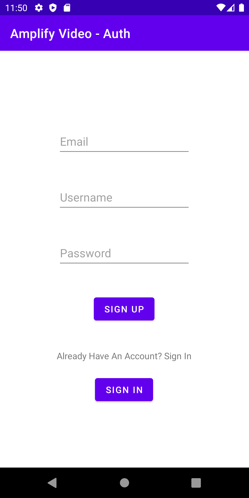
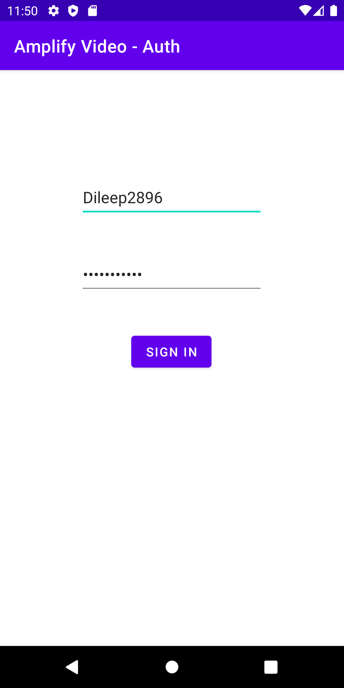

# AmplifyAuth-Video
This is a Amplify AWS Powered APP To Upload and View Video In Real Time With Authenctication

Below Are Some Image Of The App

<h2>Sign Up Screen</h2>

<h2>Sign In Screen</h2>

<h2>Video Screen Without Video</h2>

<h2>Upload Video Screen Without Video</h2>

<h2>Video Screen With Video</h2>

<h2>Upload Video Screen With Video</h2>

